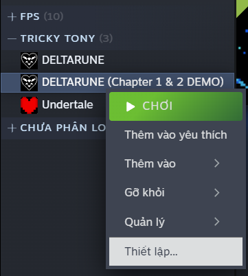
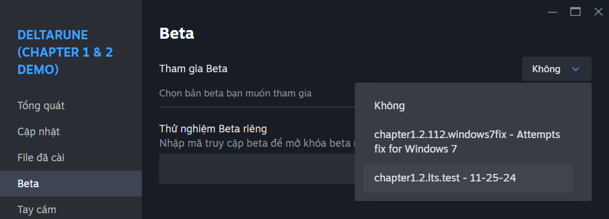
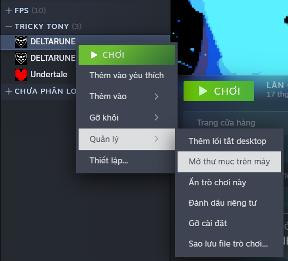
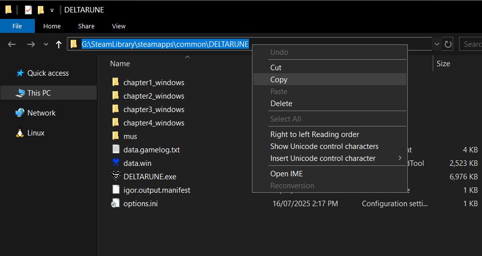
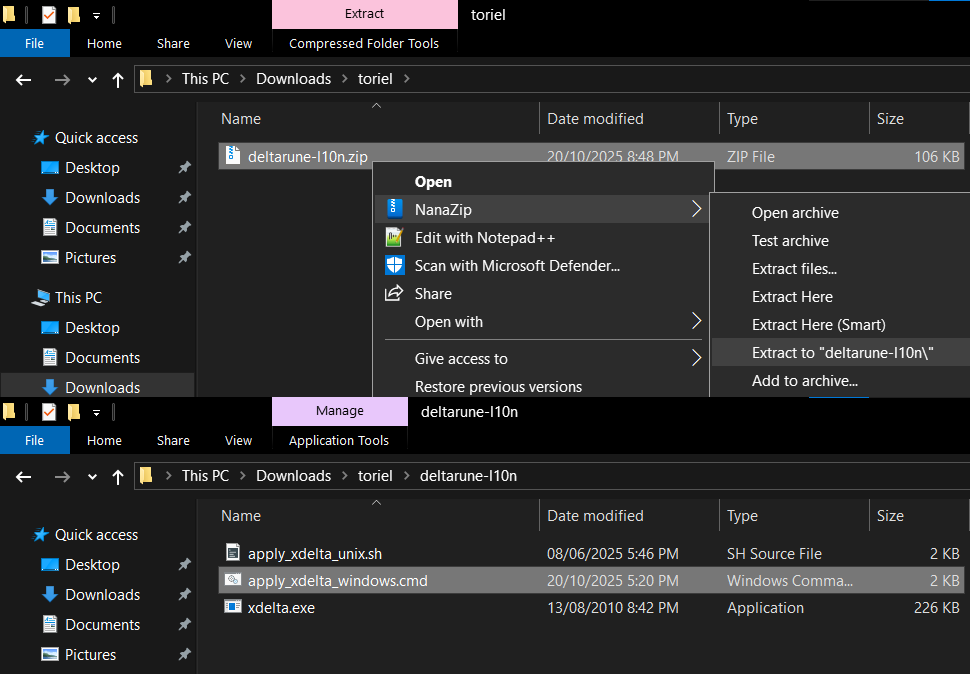
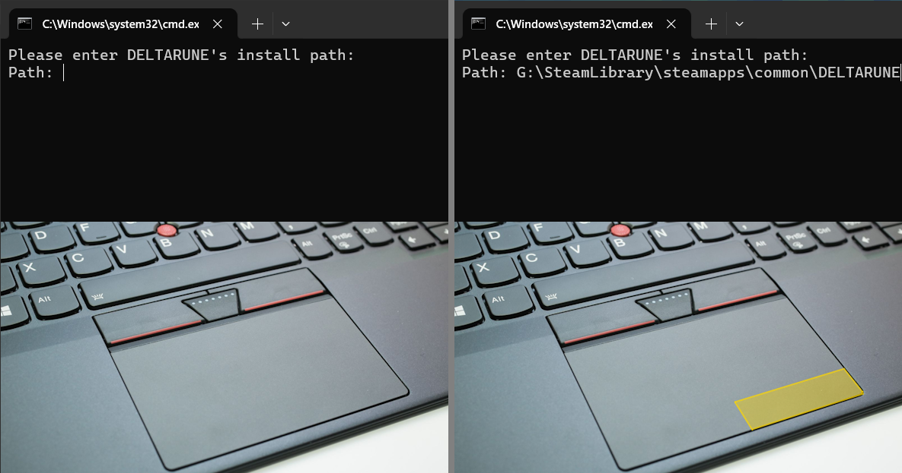
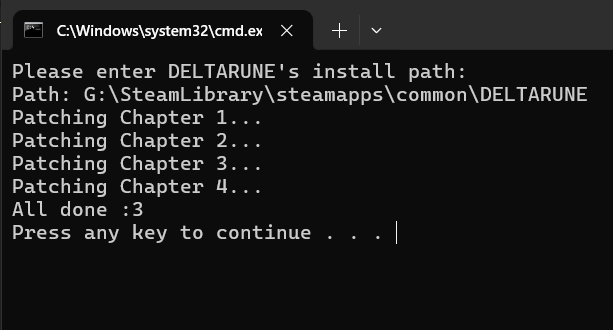

# Hướng dẫn sử dụng mod

## A. Tải về bản DEMO (bỏ qua nếu đã mua game)
1. Tải DELTARUNE DEMO trên Cửa hàng Steam
2. Mở Thư viện > Chuột phải game > Thiết lập

3. Tham gia Beta "chapter1.2.lts.test - 11-25-24"

4. Làm theo các bước sau đây

## B. Patch game
1. Tải về tệp zip chứa patch game
2. Trong Thư viện Steam, mở thư mục game

3. Sao chép đường dẫn đến thư mục

4. Giải nén file zip và mở thư mục patch. Mở script `apply_xdelta_windows.cmd`.

5. Dán đường dẫn ở bước 3 (nhấn chuột phải vào cửa sổ script) và ấn Enter

6. Chờ script chạy xong

7. Mở game